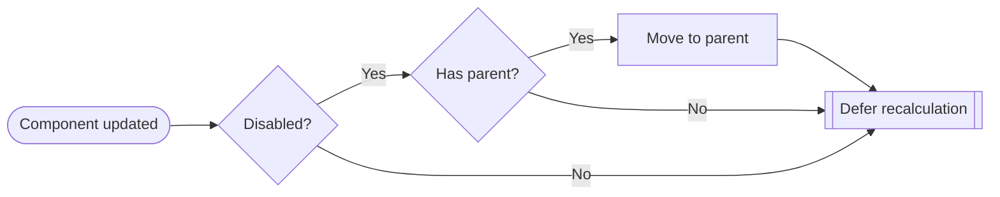
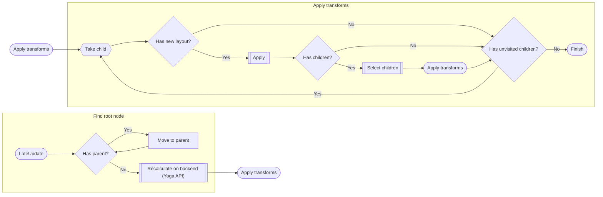

## How Reactive works with Yoga

In advance, this section is not supposed to tell you how to use the Yoga's flexbox model, that info is already available on the Yoga's website (https://www.yogalayout.dev/docs/about-yoga).
Instead, we will talk about how Yoga is implemented in Reactive and what you should know to use it flawlessly.

### Node flow

So, let's start with the basics: in Yoga every node is a controller and an item at the same time, this means that you add properties and don't care about the rest.

But Reactive's layout model is designed a little bit different: an item without an explicitly defined controller is NOT in the layout flow unless that item is not a controller itself.
This means that `.AsFlexItem` without `.AsFlexGroup` on a containing object, does nothing.

```csharp
new Background {
    Children = {
        new Label {
            Text = "Hello world"
        }.AsFlexItem()
    }
};
```

Let's look at this example. That's how it will look in the game:


But why so? What just happened? As `Background` does not have a defined controller, it just has grown up to 100x100, which is Unity's rect default size.
To fix this, we should define a controller by calling `AsFlexGroup` on the `Background`.

```csharp
new Background {
    Children = {
        new Label {
            Text = "Hello world"
        }.AsFlexItem()
    }
}.AsFlexGroup();
```

Let's take a look at the fixed version:


By a wave of the magic wand, we've got it to take all available space in the view. Furthermore, the `Label` is at the start now.
So, we've just added a flex controller that connected the background with the label. Now we can change properties to see what happens:

```csharp
new Background {
    Children = {
        new Label {
            Text = "Hello world"
        }.AsFlexItem()
    }
}.AsFlexGroup(justifyContent: Justify.Center);
```


Changing `JustifyContent` led to label being placed at the center. Pretty easy, ain't it?
Starting from this point, everything works exactly like in Yoga.

### Controller constraints

Another important thing is controller constraints. When we call Yoga's API, it expects us to provide "constraints".
The default behaviour with specified constraints is stretching, so no matter the content, with real constraints you will be getting the maximum available size all the time.
But if you want to get content-fit behaviour, you will need to provide non-numerical values: NaN.
To simplify and clarify this, we've added `ConstrainVertical` and `ConstrainHorizontal` properties to the flex group.
So in case you need fitting behaviour, you just remove the constraint by passing `false` to the following property.

<Alert type="warning">
  This only works on ROOT components, otherwise those parameters do nothing!
</Alert>

Let's look at the example. Here is the first sample without explicitly disabled constraints:

```csharp
new Background {
    Children = {
        new Label {
            Text = "Hello world"
        }.AsFlexItem()
    }
}.AsFlexGroup(justifyContent: Justify.Center);
```


And the one without the horizontal constraint:

```csharp
new Background {
    Children = {
        new Label {
            Text = "Hello world"
        }.AsFlexItem()
    }
}.AsFlexGroup(constrainHorizontal: false);
```


As you can see, it changes the size based on its content:


Another example of fitting behaviour on both axes and padding:

```csharp
new Background {
    Children = {
        new Label {
            Text = "Hello world Expanded aaaaaa"
        }.AsFlexItem()
    }
}.AsFlexGroup(
    padding: 1f,
    constrainHorizontal: false,
    constrainVertical: false,
);
```


This behaviour can be used on floating screens and similar interfaces to prevent overflowing or other visual inconsistencies.

## Under the hood

So, you've just learned about the layout system in general. But sometimes you need to know how exactly everything works to implement and optimize things.
That's what we are going to talk about next.

### Causing layout recalculation

The recalculation policy is pretty straightforward: if something has changed, the layout is dirty and needs recalculation.
There are three ways of layout recalculation:
- Immediate (happens immediately)
- Deferred (happens in LateUpdate)
- Deferred with transferred intention (basically the same as the previous one, but recalculation intention is transferred to the parent)

In 99% of cases, reactive uses either the second or the third one. But what is that 1 percent?
Well, sometimes it is necessary to maintain manual layout or have it calculated even that the object is disabled.
And here comes immediate recalculation: you subscribe to the recalculation of the main flow and cause recalculation in the second flow manually.
You would ask: why not use Deferred recalculation there, or let it recalculate automatically? That's a good question.
The answer is that it would cause a 1 frame *gap* that is usually noticeable.

So, let's get back to the *Deferred recalculation*. In general, everything is as simple as you imagine it:
when a property is updated, it tells the host that its dirty now, so it has to recalculate.
Why not do it immediately? That's another good one. What we do is bet on the case when multiple properties are updated,
and if our bet works, this way of recalculation decreases cycles count to just one.

About the *Deferred with transferred intention*. It's the same as the previous one, but happens when the object is
not capable of updating the layout itself (e.g., when it's getting disabled), so it transfers the intention to the parent.
In case there is no parent, it's assumed that the hierarchy is not visible, so no need to recalculate until it gets enabled back.

The decision flow can be explained better with a diagram:



### Recalculation process

1. Finding the Root Node

The process begins during the LateUpdate phase of a node’s lifecycle. A node checks whether it has a parent with a valid layout controller.
If it does, the process moves up the hierarchy, repeating this check until it reaches the topmost node without a parent.
This node is considered the root node for the recalculation process. Once the root node is found, it triggers layout recalculation using the backend engine (Yoga in this case).
When recalculation is done, the process continues with applying transforms from the root down.

<Alert>
  Clean nodes and their children are ignored.
</Alert>

2. Applying Transforms

Starting from the root, the system performs a depth-first traversal to apply layout updates:
The process selects the next child of the current node.
If the child has a new layout, transforms are applied to it.
If the child has its own children, they are selected for further processing.
This traversal continues recursively until all children are visited.
If a node has no more unvisited children, the process moves up or sideways until all necessary nodes are updated.
When all updates are complete, the recalculation process finishes.
This ensures that all nodes that require layout changes are updated in order from top to bottom, while clean subtrees are skipped for efficiency.

Here is a flowchart to depict the process:



That's all you should know to master the layout. Good luck!
